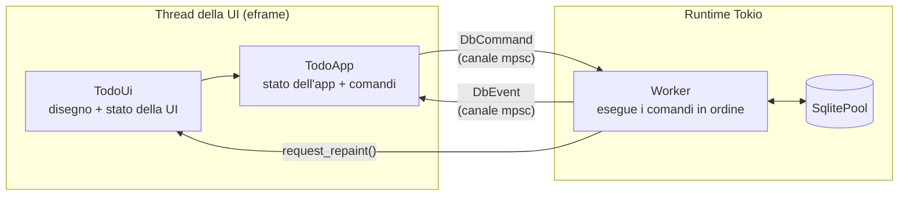
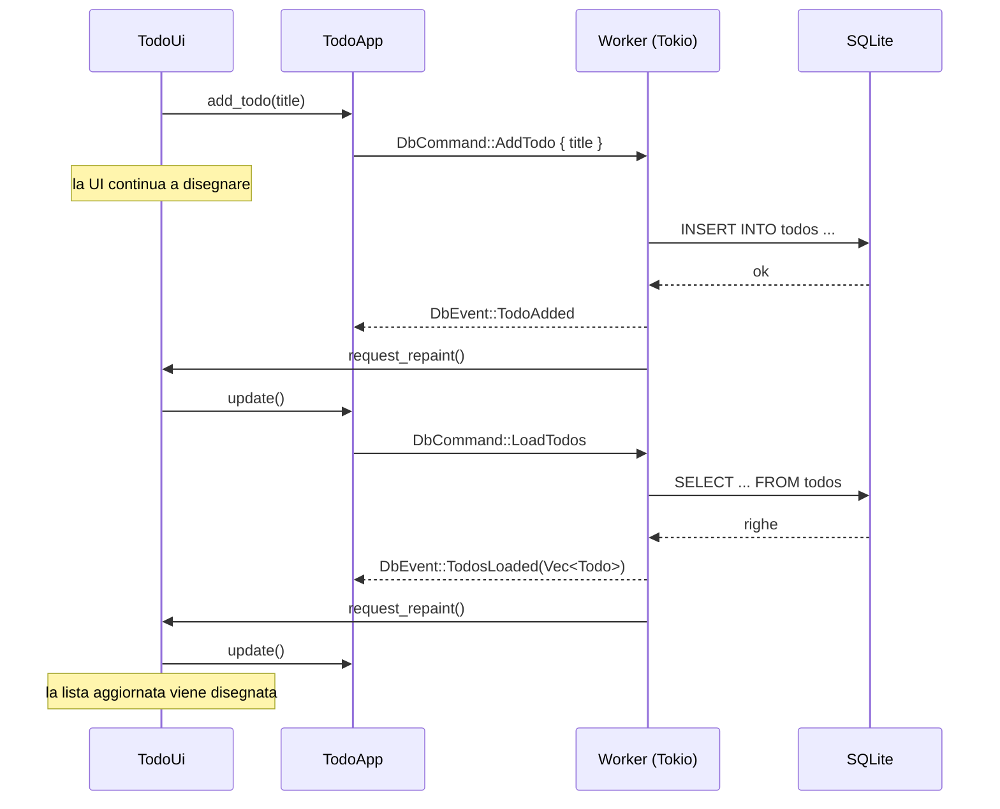
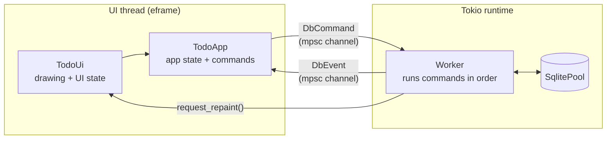
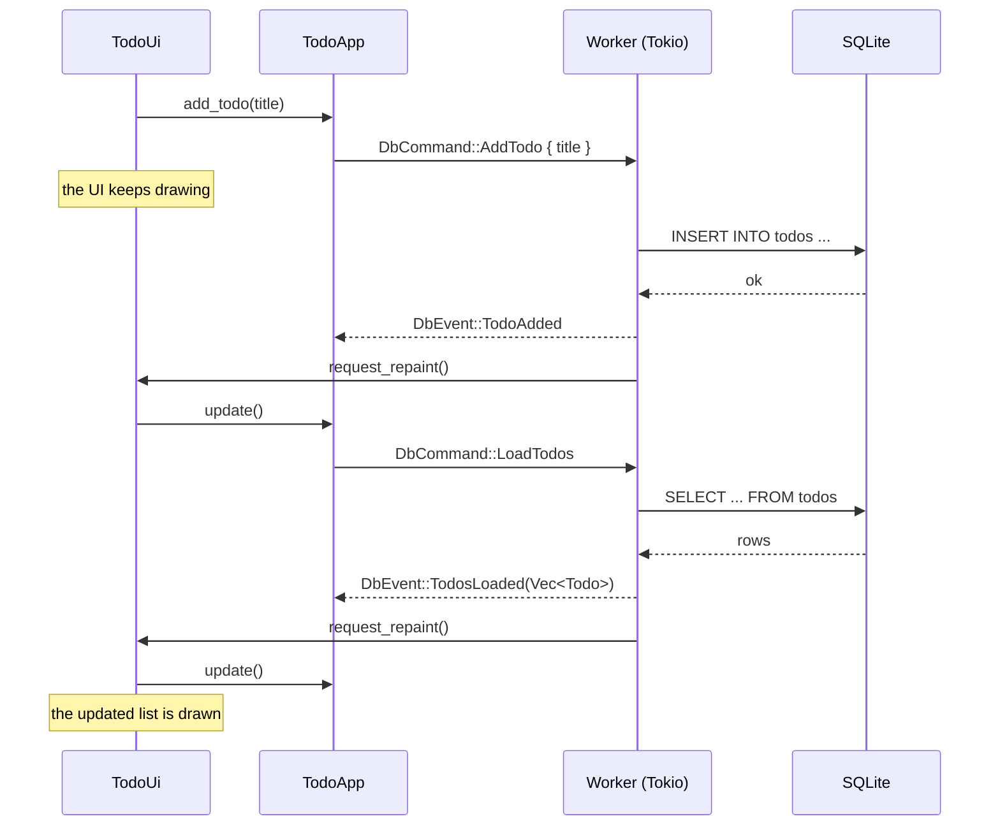

# Todo SQLx: egui + sqlx in un contesto async

> 🇬🇧 **English version below:** [jump to the English version](#english-version)

Una piccola app di todo scritta in Rust con [egui](https://github.com/emilk/egui)/eframe per l'interfaccia e [sqlx](https://github.com/launchbadge/sqlx) su SQLite per la persistenza.

Non è un'applicazione da usare, ma un **modello di riferimento**: mostra un modo semplice e corretto per far dialogare un'interfaccia immediate mode, sincrona per natura, con una libreria di accesso ai dati asincrona, e come rendere ogni parte testabile da sola.

## Il problema

egui ridisegna l'interfaccia decine di volte al secondo chiamando codice **sincrono**: dentro la funzione che disegna non si può fare `await`, e qualunque operazione lenta blocca la finestra.

sqlx, invece, è **asincrono**: ogni query restituisce un `Future` che deve essere eseguito da un runtime come Tokio.

Servono quindi due mondi separati che comunicano senza aspettarsi a vicenda.

## L'architettura in breve



- **`TodoUi`** si occupa solo dell'interfaccia: disegna, raccoglie l'input dell'utente e chiama i metodi di `TodoApp`.
- **`TodoApp`** contiene lo stato dell'applicazione (la lista dei todo) e traduce le richieste in comandi. Non sa nulla di egui né di Tokio: parla con il database attraverso il trait `DbBackend`.
- **`DbHandle`**, l'implementazione reale di `DbBackend`, invia i comandi (`DbCommand`) su un canale. La UI non esegue mai query e continua a disegnare.
- Un **worker** che vive nel runtime Tokio riceve i comandi, li esegue sul database e restituisce il risultato come evento (`DbEvent`) su un secondo canale.
- A ogni frame `TodoApp::update()` svuota il canale degli eventi con `try_recv()`, che non blocca mai, e aggiorna lo stato.
- Dopo aver inviato un evento, il worker chiama `ctx.request_repaint()`: senza questa chiamata egui, che ridisegna solo quando succede qualcosa, mostrerebbe i nuovi dati solo al successivo movimento del mouse.

## Il ciclo di un comando

Ecco cosa succede quando l'utente aggiunge un todo:



Dopo ogni modifica l'app ricarica l'intera lista. È una scelta voluta per tenere il modello semplice: lo stato mostrato coincide sempre con quello del database. Nella sezione [Possibili evoluzioni](#possibili-evoluzioni) trovi un'alternativa più efficiente.

## Struttura del codice

```
src/
├── main.rs            avvio: runtime Tokio, pool, inizializzazione del DB, eframe
├── model.rs           struct Todo (FromRow)
├── ui.rs              TodoUi (eframe::App) e TodoWidget, il widget di una riga
├── app.rs             TodoApp: stato dell'applicazione, comandi, gestione degli eventi
└── db/
    ├── mod.rs         DbCommand, DbEvent, trait DbBackend, DbHandle (canali + worker)
    ├── worker.rs      handle_command: traduce un comando in una chiamata al repository
    └── repository.rs  le query SQL, una funzione async per operazione
```

Ogni livello conosce solo quello immediatamente sotto:

| Modulo | Conosce | Non conosce |
|---|---|---|
| `ui.rs` | egui, modern-egui, `TodoApp` | canali, Tokio, sqlx |
| `app.rs` | il trait `DbBackend`, `DbCommand`, `DbEvent` | egui, Tokio, sqlx |
| `db/mod.rs` | canali, runtime, worker | l'interfaccia (solo `egui::Context` per il repaint) |
| `db/worker.rs` | comandi, eventi, repository | canali e UI |
| `db/repository.rs` | sqlx e SQL | tutto il resto |

## Aspetto grafico

L'interfaccia usa [modern-egui](https://crates.io/crates/modern-egui), una mia piccola libreria che aggiunge a egui un tema moderno chiaro e scuro, una palette di colori, valori predefiniti per spaziature e dimensioni dei caratteri e alcuni metodi di comodo su `egui::Ui` (come `primary_button` o `muted_label`). Dipende solo da egui, quindi funziona con qualsiasi integrazione, non solo con eframe.

In questo progetto serve soltanto per lo stile: la parte che riguarda egui e sqlx non dipende da essa.

## Scelte di progetto

### Il runtime è creato a mano

`main` non usa `#[tokio::main]`: costruisce il runtime esplicitamente, lo usa con `block_on` **solo all'avvio** (creazione del pool e della tabella) e poi lo cede a `DbHandle`. In questo modo il thread principale resta libero per eframe, che vuole governare il proprio event loop.

### Interfaccia e logica separate

La parte di egui è divisa in tre pezzi, ognuno con un compito solo:

- **`TodoApp`** possiede lo stato che conta (la lista dei todo) e l'accesso al database. Il metodo `update()` elabora gli eventi arrivati e restituisce un `UpdateResult` con due informazioni: se lo stato è cambiato e se c'è stato un errore.
- **`TodoUi`** implementa `eframe::App` e possiede lo stato che riguarda solo l'interfaccia: il testo in fase di scrittura e l'ultimo errore da mostrare, che l'utente può chiudere. In `logic()` chiama `update()`; in `ui()` disegna.
- **`TodoWidget`** è un widget personalizzato (implementa `egui::Widget`) che disegna una riga. Non invia comandi: registra l'azione dell'utente (`Toggle` o `Delete`) e la espone con `take_action()`. Sarà `TodoUi` a decidere cosa farne.

### Il trait `DbBackend`

`TodoApp` non dipende da `DbHandle` ma da un trait:

```rust
pub trait DbBackend {
    fn send(&self, command: DbCommand) -> Result<(), DbCommand>;
    fn try_recv(&mut self) -> Option<DbEvent>;
}
```

In esecuzione si usa `DbHandle`, con canali, worker e SQLite. Nei test si usa un backend finto che registra i comandi ricevuti e restituisce eventi preparati in anticipo: così la logica dell'applicazione si verifica senza database, senza runtime e senza interfaccia.

### Due canali, due tipi

`DbCommand` (verso il worker) e `DbEvent` (dal worker) sono enum distinti. Chi legge il codice vede subito tutte le operazioni possibili e tutti i risultati possibili, e il compilatore obbliga a gestire ogni caso nel `match`.

Entrambi i canali sono `tokio::sync::mpsc` senza limite di capacità: l'invio è sincrono (`send` non richiede `await`), quindi si può usare direttamente dal codice della UI.

### Il worker è sequenziale

Il worker elabora un comando alla volta, nell'ordine in cui arrivano:

```rust
while let Some(command) = command_rx.recv().await {
    let event = handle_command(&pool, command).await;
    // ...
}
```

Questo garantisce che un `LoadTodos` inviato dopo un `AddTodo` veda il nuovo record. Con SQLite, che ammette un solo scrittore alla volta, eseguire i comandi in parallelo non porterebbe comunque grandi vantaggi.

Il database è aperto in modalità WAL e con un `busy_timeout` di 5 secondi, le impostazioni consigliate per SQLite in un'app desktop.

### Chiusura pulita

Alla chiusura della finestra, il `Drop` di `DbHandle`:

1. chiude il canale dei comandi, così il worker esegue quelli ancora in coda ed esce dal ciclo;
2. aspetta la fine del worker con `block_on`, lecito perché `drop` gira sul thread della UI e non dentro il runtime;
3. solo a quel punto lascia distruggere il runtime.

Quando il worker termina, il pool che possedeva viene distrutto e le connessioni vengono rilasciate. Senza questa sequenza il runtime verrebbe distrutto per primo e cancellerebbe il worker anche nel mezzo di una query.

## Test

```sh
cargo test
```

Grazie alla separazione in livelli, ognuno ha i propri test e non ha bisogno degli altri:

| Livello | Cosa verifica | Come |
|---|---|---|
| `db/repository.rs` | le query SQL | un database SQLite in memoria per ogni test |
| `db/worker.rs` | la traduzione da comando a evento, errori compresi | chiama `handle_command` direttamente in un `#[tokio::test]` |
| `db/mod.rs` | il percorso completo attraverso canali e worker | un `DbHandle` vero su database in memoria; i test interrogano `try_recv()` finché l'evento non arriva |
| `app.rs` | la logica dell'applicazione | un backend finto che implementa `DbBackend` |
| `ui.rs` | il widget di una riga | [egui_kittest](https://crates.io/crates/egui_kittest), che simula il clic sulla casella e sul pulsante e verifica l'azione prodotta |

Un dettaglio da conoscere: con `sqlite::memory:` **ogni connessione apre un database diverso**. Per questo i pool dei test hanno `max_connections(1)`: con più connessioni una query potrebbe finire su un database dove la tabella non esiste.

## Avvio

Serve una versione recente di Rust stabile: il progetto usa l'edition 2024, che richiede almeno Rust 1.85.

```sh
cargo run
```

Al primo avvio viene creato il file `app.db` nella **cartella da cui lanci il comando**, con la tabella `todos`. Mentre l'app è aperta, la modalità WAL crea accanto anche i file `app.db-wal` e `app.db-shm`.

## Possibili evoluzioni

Il progetto resta volutamente minimale. Alcuni passi naturali per portarlo verso un'app reale:

- **Eventi che trasportano i dati.** Invece di ricaricare l'intera lista dopo ogni modifica, `TodoAdded(Todo)` (con `INSERT ... RETURNING`), `TodoUpdated { id, done }` e `TodoDeleted { id }` permettono di aggiornare lo stato locale direttamente.
- **Errori di lettura e di scrittura separati.** Dopo un errore di scrittura conviene ricaricare i dati per riallineare la UI; dopo un errore di lettura no, altrimenti si rischia un ciclo di tentativi.
- **Aggiornamento ottimistico.** Applicare subito le modifiche allo stato locale e riallinearlo solo in caso di errore, così l'interfaccia risponde senza aspettare il database.
- **Migrazioni** con `sqlx::migrate!()` al posto di `CREATE TABLE IF NOT EXISTS`.
- **Percorso del database** nella cartella dati dell'utente invece che in quella corrente.

## Licenza

Distribuito con licenza MIT. Il testo completo è nel file [LICENSE](LICENSE).

---

## English version

> 🇮🇹 [Torna alla versione italiana](#todo-sqlx-egui--sqlx-in-un-contesto-async)

A small todo app written in Rust, using [egui](https://github.com/emilk/egui)/eframe for the UI and [sqlx](https://github.com/launchbadge/sqlx) on SQLite for persistence.

It is not meant to be used as an application, but as a **reference model**: it shows a simple and correct way to make an immediate mode UI, which is synchronous by nature, work with an asynchronous data access library, and how to make each part testable on its own.

### The problem

egui redraws the interface dozens of times per second by calling **synchronous** code: you cannot `await` inside the drawing function, and any slow operation freezes the window.

sqlx, on the other hand, is **asynchronous**: every query returns a `Future` that must be driven by a runtime such as Tokio.

So we need two separate worlds that communicate without waiting on each other.

### Architecture at a glance



- **`TodoUi`** only deals with the interface: it draws, collects user input and calls `TodoApp` methods.
- **`TodoApp`** holds the application state (the todo list) and turns requests into commands. It knows nothing about egui or Tokio: it talks to the database through the `DbBackend` trait.
- **`DbHandle`**, the real `DbBackend` implementation, sends commands (`DbCommand`) over a channel. The UI never runs queries and keeps drawing.
- A **worker** living in the Tokio runtime receives commands, runs them against the database and sends the result back as an event (`DbEvent`) over a second channel.
- On every frame `TodoApp::update()` drains the event channel with `try_recv()`, which never blocks, and updates the state.
- After sending an event, the worker calls `ctx.request_repaint()`: without it, egui, which only redraws when something happens, would show the new data only on the next mouse movement.

### Lifecycle of a command

Here is what happens when the user adds a todo:



After every change the app reloads the whole list. This is a deliberate choice to keep the model simple: what is displayed always matches the database. The [Possible improvements](#possible-improvements) section describes a more efficient alternative.

### Code structure

```
src/
├── main.rs            startup: Tokio runtime, pool, DB initialization, eframe
├── model.rs           Todo struct (FromRow)
├── ui.rs              TodoUi (eframe::App) and TodoWidget, the widget for one row
├── app.rs             TodoApp: application state, commands, event handling
└── db/
    ├── mod.rs         DbCommand, DbEvent, DbBackend trait, DbHandle (channels + worker)
    ├── worker.rs      handle_command: maps a command to a repository call
    └── repository.rs  SQL queries, one async function per operation
```

Each layer only knows about the one directly below it:

| Module | Knows about | Doesn't know about |
|---|---|---|
| `ui.rs` | egui, modern-egui, `TodoApp` | channels, Tokio, sqlx |
| `app.rs` | the `DbBackend` trait, `DbCommand`, `DbEvent` | egui, Tokio, sqlx |
| `db/mod.rs` | channels, runtime, worker | the UI (only `egui::Context` for repainting) |
| `db/worker.rs` | commands, events, repository | channels and UI |
| `db/repository.rs` | sqlx and SQL | everything else |

### Look and feel

The UI uses [modern-egui](https://crates.io/crates/modern-egui), a small library of mine that adds to egui a modern light and dark theme, a color palette, design tokens for spacing and font sizes, and a few convenience methods on `egui::Ui` (such as `primary_button` or `muted_label`). It depends only on egui, so it works with any egui integration, not just eframe.

In this project it is used for styling only: the egui + sqlx part doesn't depend on it.

### Design choices

#### The runtime is built manually

`main` does not use `#[tokio::main]`: it builds the runtime explicitly, uses it with `block_on` **only at startup** (creating the pool and the table) and then hands it over to `DbHandle`. This keeps the main thread free for eframe, which wants to own its event loop.

#### UI and logic kept apart

The egui side is split into three pieces, each with a single job:

- **`TodoApp`** owns the state that matters (the todo list) and the database access. Its `update()` method processes incoming events and returns an `UpdateResult` telling whether the state changed and whether an error occurred.
- **`TodoUi`** implements `eframe::App` and owns the state that only concerns the interface: the text being typed and the last error to display, which the user can dismiss. It calls `update()` in `logic()` and draws in `ui()`.
- **`TodoWidget`** is a custom widget (it implements `egui::Widget`) that draws one row. It doesn't send commands: it records the user's action (`Toggle` or `Delete`) and exposes it through `take_action()`. `TodoUi` decides what to do with it.

#### The `DbBackend` trait

`TodoApp` doesn't depend on `DbHandle` but on a trait:

```rust
pub trait DbBackend {
    fn send(&self, command: DbCommand) -> Result<(), DbCommand>;
    fn try_recv(&mut self) -> Option<DbEvent>;
}
```

At runtime the app uses `DbHandle`, with channels, worker and SQLite. Tests use a fake backend that records the commands it receives and returns events prepared in advance: this way the application logic is tested without a database, a runtime or a UI.

#### Two channels, two types

`DbCommand` (to the worker) and `DbEvent` (from the worker) are separate enums. Anyone reading the code immediately sees every possible operation and every possible result, and the compiler forces every case to be handled in `match`.

Both channels are unbounded `tokio::sync::mpsc` channels: sending is synchronous (`send` needs no `await`), so it can be called directly from UI code.

#### The worker is sequential

The worker processes one command at a time, in the order they arrive:

```rust
while let Some(command) = command_rx.recv().await {
    let event = handle_command(&pool, command).await;
    // ...
}
```

This guarantees that a `LoadTodos` sent after an `AddTodo` sees the new record. With SQLite, which allows only one writer at a time, running commands in parallel wouldn't bring much benefit anyway.

The database is opened in WAL mode with a 5-second `busy_timeout`, the recommended settings for SQLite in a desktop app.

#### Clean shutdown

When the window is closed, the `Drop` implementation of `DbHandle`:

1. closes the command channel, so the worker runs any queued commands and exits its loop;
2. waits for the worker to finish with `block_on`, which is allowed because `drop` runs on the UI thread, not inside the runtime;
3. only then lets the runtime be destroyed.

When the worker ends, the pool it owns is dropped and its connections are released. Without this sequence the runtime would be destroyed first, cancelling the worker even in the middle of a query.

### Testing

```sh
cargo test
```

Thanks to the layered design, each layer has its own tests and doesn't need the others:

| Layer | What is tested | How |
|---|---|---|
| `db/repository.rs` | the SQL queries | an in-memory SQLite database per test |
| `db/worker.rs` | mapping commands to events, errors included | calls `handle_command` directly in a `#[tokio::test]` |
| `db/mod.rs` | the full path through channels and worker | a real `DbHandle` on an in-memory database; tests poll `try_recv()` until the event arrives |
| `app.rs` | the application logic | a fake backend implementing `DbBackend` |
| `ui.rs` | the row widget | [egui_kittest](https://crates.io/crates/egui_kittest), which simulates clicks on the checkbox and the button and checks the resulting action |

One detail worth knowing: with `sqlite::memory:` **each connection opens a different database**. That's why test pools use `max_connections(1)`: with more connections a query could land on a database where the table doesn't exist.

### Running

You need a recent stable Rust: the project uses the 2024 edition, which requires at least Rust 1.85.

```sh
cargo run
```

On first launch, an `app.db` file with the `todos` table is created in the **directory you run the command from**. While the app is running, WAL mode also creates `app.db-wal` and `app.db-shm` next to it.

### Possible improvements

The project is intentionally minimal. Some natural next steps towards a real application:

- **Events that carry data.** Instead of reloading the whole list after each change, `TodoAdded(Todo)` (with `INSERT ... RETURNING`), `TodoUpdated { id, done }` and `TodoDeleted { id }` let the app update its local state directly.
- **Separate read and write errors.** After a write error it makes sense to reload the data to resync the UI; after a read error it doesn't, otherwise you risk an endless retry loop.
- **Optimistic updates.** Apply changes to the local state immediately and resync only on error, so the UI responds without waiting for the database.
- **Migrations** with `sqlx::migrate!()` instead of `CREATE TABLE IF NOT EXISTS`.
- **Database path** in the user's data directory instead of the current one.

### License

Released under the MIT License. See the [LICENSE](LICENSE) file for the full text.
