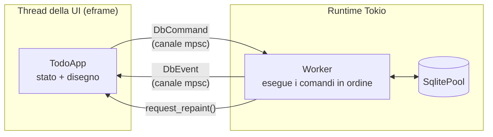
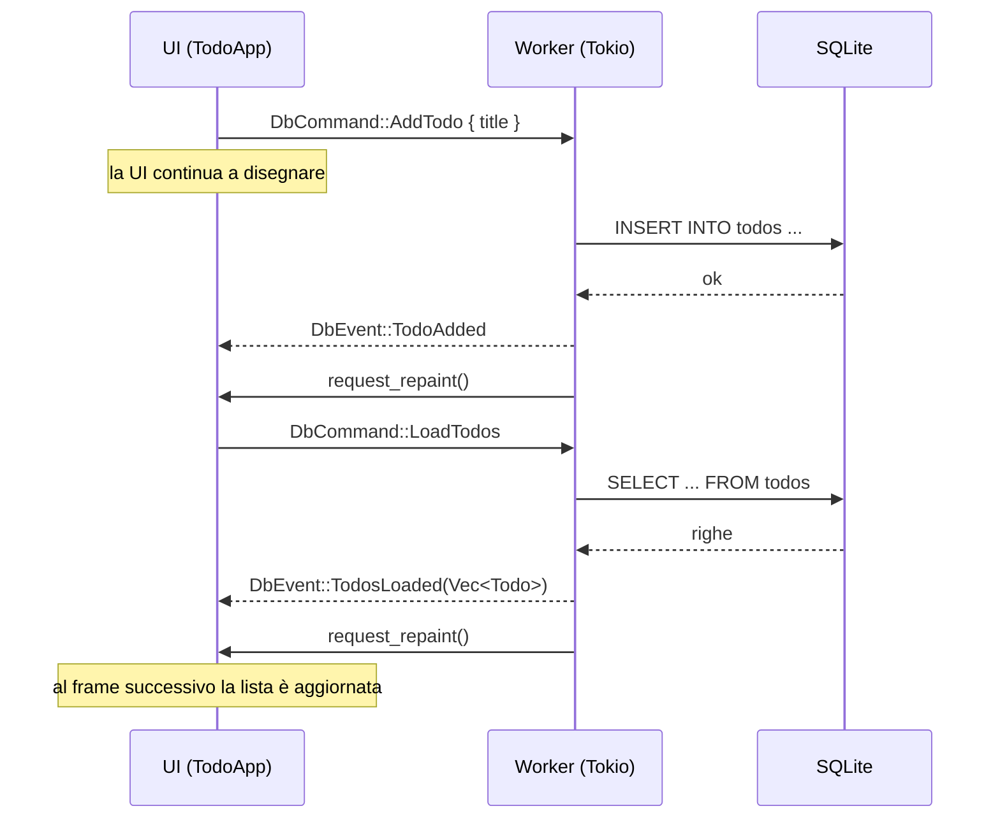

# Todo SQLx: egui + sqlx in un contesto async

Una piccola app di todo scritta in Rust con [egui](https://github.com/emilk/egui)/eframe per l'interfaccia e [sqlx](https://github.com/launchbadge/sqlx) su SQLite per la persistenza.

Non è un'applicazione da usare, ma un **modello di riferimento**: mostra un modo semplice e corretto per far dialogare un'interfaccia immediate mode, sincrona per natura, con una libreria di accesso ai dati asincrona.

## Il problema

egui ridisegna l'interfaccia decine di volte al secondo chiamando codice **sincrono**: dentro la funzione che disegna non si può fare `await`, e qualunque operazione lenta blocca la finestra.

sqlx, invece, è **asincrono**: ogni query restituisce un `Future` che deve essere eseguito da un runtime come Tokio.

Servono quindi due mondi separati che comunicano senza aspettarsi a vicenda.

## L'architettura in breve



- La UI **non esegue mai query**: invia un comando (`DbCommand`) su un canale e prosegue con il disegno.
- Un **worker** che vive nel runtime Tokio riceve i comandi, li esegue sul database e restituisce il risultato come evento (`DbEvent`) su un secondo canale.
- A ogni frame la UI svuota il canale degli eventi con `try_recv()`, che non blocca mai, e aggiorna il proprio stato.
- Dopo aver inviato un evento, il worker chiama `ctx.request_repaint()`: senza questa chiamata egui, che ridisegna solo quando succede qualcosa, mostrerebbe i nuovi dati solo al successivo movimento del mouse.

## Il ciclo di un comando

Ecco cosa succede quando l'utente aggiunge un todo:



Dopo ogni modifica la UI ricarica l'intera lista. È una scelta voluta per tenere il modello semplice: lo stato mostrato coincide sempre con quello del database. Nella sezione [Possibili evoluzioni](#possibili-evoluzioni) trovi un'alternativa più efficiente.

## Struttura del codice

```
src/
├── main.rs            avvio: runtime Tokio, pool, inizializzazione del DB, eframe
├── model.rs           struct Todo (FromRow)
├── app.rs             TodoApp: stato dell'interfaccia, gestione degli eventi, disegno
└── db/
    ├── mod.rs         DbCommand, DbEvent, DbHandle (canali + worker)
    ├── worker.rs      handle_command: traduce un comando in una chiamata al repository
    └── repository.rs  le query SQL, una funzione async per operazione
```

Ogni livello conosce solo quello immediatamente sotto:

| Modulo | Conosce | Non conosce |
|---|---|---|
| `app.rs` | `DbHandle`, `DbCommand`, `DbEvent` | Tokio, sqlx, SQL |
| `db/mod.rs` | canali, runtime, worker | l'interfaccia (solo `egui::Context` per il repaint) |
| `db/worker.rs` | comandi, eventi, repository | canali e UI |
| `db/repository.rs` | sqlx e SQL | tutto il resto |

## Scelte di progetto

### Il runtime è creato a mano

`main` non usa `#[tokio::main]`: costruisce il runtime esplicitamente, lo usa con `block_on` **solo all'avvio** (creazione del pool e della tabella) e poi lo cede a `DbHandle`. In questo modo il thread principale resta libero per eframe, che vuole governare il proprio event loop.

### Due canali, due tipi

`DbCommand` (dalla UI al worker) e `DbEvent` (dal worker alla UI) sono enum distinti. Chi legge il codice vede subito tutte le operazioni possibili e tutti i risultati possibili, e il compilatore obbliga a gestire ogni caso nel `match`.

Entrambi i canali sono `tokio::sync::mpsc` senza limite di capacità: l'invio è sincrono (`send` non richiede `await`), quindi si può usare direttamente dal codice della UI.

### Il worker è sequenziale

Il worker elabora un comando alla volta, nell'ordine in cui arrivano:

```rust
while let Some(command) = command_rx.recv().await {
    let event = handle_command(&pool, command).await;
    // ...
}
```

Questo garantisce che un `LoadTodos` inviato dopo un `AddTodo` veda il nuovo record. Con SQLite, che ammette un solo scrittore alla volta, eseguire i comandi in parallelo non porterebbe comunque grandi vantaggi.

### Chiusura pulita

Alla chiusura della finestra, il `Drop` di `DbHandle`:

1. chiude il canale dei comandi, così il worker esegue quelli ancora in coda ed esce dal ciclo;
2. aspetta la fine del worker con `block_on`, lecito perché `drop` gira sul thread della UI e non dentro il runtime;
3. solo a quel punto lascia distruggere il runtime.

Il worker, uscito dal ciclo, chiude il pool con `pool.close().await`. Senza questo passaggio il runtime verrebbe distrutto per primo e cancellerebbe il worker anche nel mezzo di una query.

## Avvio

```sh
cargo run
```

Al primo avvio viene creato il file `app.db` nella **cartella da cui lanci il comando**, con la tabella `todos`.

## Possibili evoluzioni

Il progetto resta volutamente minimale. Alcuni passi naturali per portarlo verso un'app reale:

- **Eventi che trasportano i dati.** Invece di ricaricare l'intera lista dopo ogni modifica, `TodoAdded(Todo)` (con `INSERT ... RETURNING`), `TodoUpdated { id, done }` e `TodoDeleted { id }` permettono di aggiornare lo stato locale direttamente.
- **Errori di lettura e di scrittura separati.** Dopo un errore di scrittura conviene ricaricare i dati per riallineare la UI; dopo un errore di lettura no, altrimenti si rischia un ciclo di tentativi.
- **Aggiornamento ottimistico.** Applicare subito le modifiche allo stato locale e riallinearlo solo in caso di errore, così l'interfaccia risponde senza aspettare il database.
- **Migrazioni** con `sqlx::migrate!()` al posto di `CREATE TABLE IF NOT EXISTS`.
- **Percorso del database** nella cartella dati dell'utente invece che in quella corrente.

## Licenza

<!-- Indica qui la licenza scelta, per esempio MIT o Apache-2.0 -->
